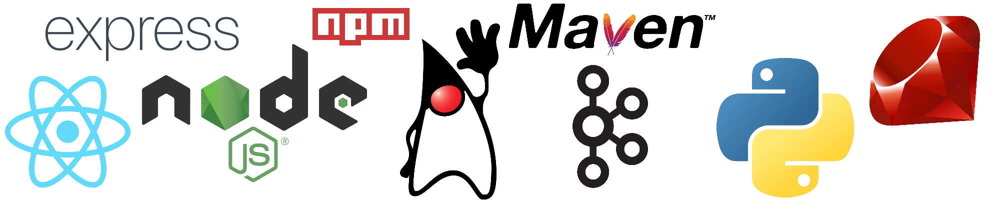

## An application for performance measuring / testing and personnel training using Event-Driven Architecture, event replay and Apache Kafka.

### Table of contents
1. [Introduction](#intro)
2. [ENV Setup](#env)
3. [Kafka Cluster](#kafka)
4. [NodeUtilityApp](#nodeapp)
5. [JavaUtilityApp](#javaapp)
6. [Testing apps](#testapp)
7. [Port numbers list](#portlist)

### Introduction 
Good day! This is a prototype branch of the GitHub repository of my Thesis project. Remember to read this file carefully so you will know how to set this project up properly!

The project consists of 3 components:
<ol>
<li>NodeUtilityApp - provides GUI for user for easier to interact with the application.</li>
<li>JavaUtilityApp - intakes data as streams and performs broadcasts to requested clients.</li>
<li>Kafka Cluster - self-explanatory component.</li>
</ol>

Sub-components for testings:
<ol>
<li>NodeDistributorApp - provides GUI for user for easier to send test data.</li>
<li>PySorterApp - processes test data and publishes result data.</li>
<li>RubyReporterApp - receives processed result data.</li>
</ol>

### ENV Setup 
Before starting the components, environment variables need to be initialized. In each component, there is a `misc` folder containing some other files and an `env BASE.txt` file. Simply extract the `env BASE.txt` file to the root directory of each component or and rename it to `.env` to let the components recognize it.

**Note:** NodeJS front end applications, including the `NodeUtilityApp` and `NodeDistributorApp`, do not need the `.env` as ENV related inputs can be edited via `deploy.sh` script. For the `JavaUtilityApp`, it does not need the `.env` file either as the application takes command line arguments.

### Kafka Cluster 
This is an Apache Kafka application. So make sure [it is](https://kafka.apache.org/downloads) downloaded first (The version of which recommended by themselves is preferred). Also, it is advised to run Kafka in Linux as many experienced users have proven the app utilizes better resources and possesses better performance than that of Windows. Not to mention the required set up steps in order for Kafka to run in Windows. After that, follow these steps:
 
1. Extract the contents of the downloaded Kafka application. **Make sure the directory path of it DOES NOT contain any spaces!** For example, the path `C:/ProgramData/Broker Server/kafka` is invalid as it contains a single white space. 
2. Extract the configuration and launch scripts in `Kafka Configs` of the repository into the installation directory of the downloaded Kafka app. 
3. `cd` to the Kafka application root and run `./start-ZK.sh` to start the Zookeeper server first (The syntax is the same regardless of using either WSL or Linux, if you use Linux, make sure that Java is installed beforehand!). 
4. Run `./start-BKx.sh` to start Broker #x (1 -> 2) with x as the broker ID. Currently there are `2` brokers, more might be added later.
5. Kafka Cluster is online and operational. Perform testings.

To shutdown the Kafka Cluster, stop the Kafka brokers first by running `./stop-BKs.sh`. Then run `./stop-ZK.sh` to stop the Zookeeper server. **DO NOT STOP THE ZOOKEEPER FIRST! If the Zookeeper server is terminated while its brokers are still running, the Zookeeper server needs to be run again so that the brokers can be shutdown!**

### NodeUtilityApp 
This is a NodeJS application used for providing GUI to display data and various available services to interact with data.
1. Have [NodeJS](https://nodejs.org) installed.
2. `cd` to the directory `/NodeUtilityApp`.
3. `cd` to both `backapp`, `frontapp` and run `npm install` of each directory to get required dependencies.
4. For `backapp`, run `nodemon startApp` or `node startApp` or execute the discrete script `deploy.sh`.
5. For `frontapp`, run `npm run build` first. Once the process is completed, run `serve -s build` or execute a discrete script `deploy.sh`.

### JavaUtilityApp 
This is a Java application used for receiving data as streams. Follow the steps:
1. Have Java installed. More specifically, JDK 16 (64-bit) or higher is preferred.
2. Have Maven installed as this App was built using Maven archetype. Either interfacing Maven with command line or Visual Studio Code's extension is OK.
3. `cd` to `jksa` directory of the App. If command line is preferred, run `mvn package` to get all required dependencies and build the project. If Visual Studio Code's extension is preferred, simply run the project to build it.
4. After building, a folder named `target` will be created within the `jksa` folder. In such folder, an output `.jar` file should be present as the result of the Maven build command. Use a terminal to `cd` to the `target` folder and run this command line with arguments to start the Java application:  `java -jar jksa*.jar <Broker Address> <Broker Port> <SocketIO Address> <SocketIO Port> [Enable Debug]`  Where angle brackets `<>` indicate **MANDATORY** argument whereas square brackets `[]` indicate **OPTIONAL** argument.
 **Note**: For `Broker Address` and `SocketIO Address`, one may use their PC's name as an input or just simply use `localhost`. For the ports, consult the `Port numbers list` section below.
5. To stop, use either the following methods:
- Ctrl + C in the running terminal.
- Stop button in Visual Studio Code IDE.
- Interact via the `NodeUtilityApp` front end.

### Testing apps 
This is a set of 3 applicationss used for testing the project. It is actually a simple Integer array generator used for creating randomized data and sending to the actual application for data capture.

1. [NodeDistributorApp](#nodetestapp)
2. [PySorterApp](#pytestapp)
3. [RubyReporterApp](#rubytestapp)
</ol>

#### NodeDistributorApp 
This is a NodeJS application providing GUI for generating randomized data.
1. Have [NodeJS](https://nodejs.org) installed.
2. `cd` to the directory `/Testing Apps/NodeDistributorApp`.
3. `cd` to both `backapp`, `frontapp` and run `npm install` of each directory to get required dependencies.
4. For `backapp`, run `nodemon startApp` or `node startApp` or execute the discrete script `deploy.sh`.
5. For `frontapp`, run `npm run build` first. Once the process is completed, run `serve -s build` or execute a discrete script `deploy.sh`.

#### PySorterApp 
This is a Python application responsible for processing data generated by the `NodeDistributorApp`. Data is received from then and processed so as to output result data to the `RubyReporterApp`.
1. Have [Python](https://www.python.org/downloads/) installed. Latest version preferred.
2. `cd` to the directory `/Testing Apps/PySorterApp`.
3. Run `pip install -r requirements.txt` to get all required dependencies.
4. Run `py main.py` or `python main.py` to run the application.

#### RubyReporterApp 
This is a Ruby application in charge of receiving test result data and serves no significant purpose in action. Therefore, it is optional to have this application active.
1. Have [Ruby](https://www.ruby-lang.org/en/downloads/) installed. Latest version preferred.
2. `cd` to the directory `/Testing Apps/RubyReporterApp`.
3. Run `bundle install` to get all required dependencies.
4. Run `ruby main.rb` to run the application.

### Port numbers list: 
Here is a list of ports defined in the making of this project. If you want to define it yourself, remember to create your own `.env` and use your desired value!
<ol>
  <li>NodeUtilityApp</li>
  <ul>
    <li>Front app: 3000</li>
    <li>Back app: 3001</li>
  </ul>
  <li>JavaUtilityApp</li>
  <ul>
    <li>Broker Ports: 9091 - 9092</li>
    <li>SocketIO Port: 3004</li>
  </ul>
  <li>Testing Apps</li>
  <ul>
    <li>Distributor front app: 3002</li>
    <li>Distributor back app: 3003</li>
  </ul>
</ol>

### That's about it. Thanks for reading!